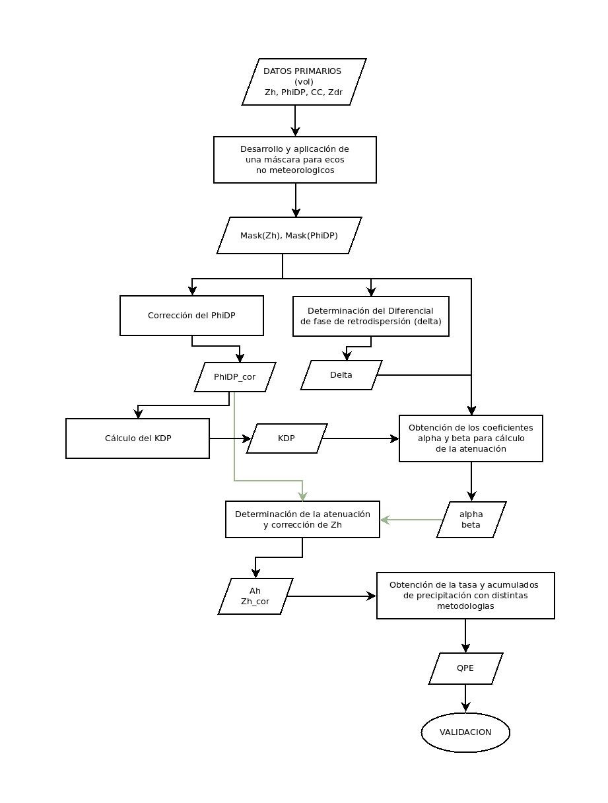

# Doctorado

En este repositorio se encuentran los scripts para obtener los resultados de la tesis doctoral de Romina Mezher.

1) **mascara.py**: genera un archivo nc con los datos de los radares enmascarados de ecos no meteorologicos. La entrada es un archivo .vol de radares Gematronik.

2) **phidp.py**: se corrige y calcula el nuevo diferencial de cambio de fase para utilizar una variable limpia y sin errores.

2) **backscatter.py**: a su vez se calcula el diferencial de cambio de fase de retrodispersion 

3) **kdp.py**: se calcula el diferencial de cambio de fase especifico.

4) **alpha_beta.py**: para obtener los coeficientes que se utiliaran luego en el calculo de la atenuacion.

5) **atenuacion_aislada.py**, atenuacion_correccion.py, atenuacion_diferencial.py: calcula la atenuacion y atenuacion diferencial con diferentes metodologias. Aislada utiliza el metodo simple y correccion utilizada el metodo ZPHI y ademas se obtiene en ambos el Z corregido por atenuacion. 

6) **tasa_precipitacion_R-A.py,tasa_precipitacion_R-KDP.py,tasa_precipitacion_Z-R.py**: se obtienen las tasas de precipitacion con cada una de las metodologias. Con atenuacion, con KDP y con la relacion Z-R.

7) **acumulado_precipitacion.py**: se obtiene un archivo nc con el acumulado de precipitacion calculado con las tasas para cada metodo. 

En la Figura se muestran los pasos a seguir:

  

